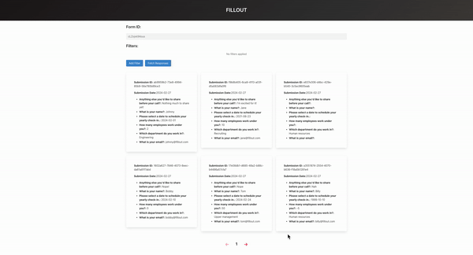

# 📸 Form Responses Viewer

Fillout is a React application designed to facilitate viewing and filtering responses submitted through online forms. It connects to an API endpoint to fetch form submissions and allows users to apply filters to narrow down the displayed responses.

# ✨ Features

- Dynamic Filtering: Filter responses based on various criteria such as question value, submission ID, etc.
- Pagination: Display responses in paginated format for easier navigation and management.
- Interactive UI: User-friendly interface for adding, removing, and configuring filters.
- Real-time Data Updates: Fetch and display responses in real-time as filters or page changes.

# 🎥 Demo

.

# 🔧 Local Setup Guidelines

1. Clone the repository:

```bash
git clone https://github.com/KevinLively/Fillout
```

2. Navigate to the front-end directory:

```bash
cd Client
```

3. Install dependencies:

```bash
npm install
```

4. Start the front-end development server:

```bash
npm start
```

5. Navigate to the back-end directory from root:

```bash
cd Server
```

3. Install dependencies:

```bash
npm install
```

4. Start the front-end development server:

```bash
nodemon
```

5. Access the application in your browser at http://localhost:3000.

# 📘 API Documentation

For fetching form submissions, the application relies on a custom API endpoint. Refer to the API documentation for detailed information on endpoints, request parameters, and response formats.
